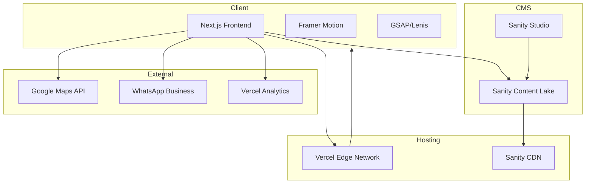

# Black Sand Real Estate Website - Architecture & Implementation Plan

## Executive Summary

A complete rebuild of blacksand.sa into a stunning, modern real estate website with rich animations, bilingual support (Arabic/English with RTL), and a headless CMS architecture using Sanity.

---

## 1. Technology Stack

### Frontend Framework
- **Next.js 14** (App Router) - React framework with server-side rendering
  - Excellent SEO capabilities (critical for real estate)
  - Built-in internationalization (i18n) support
  - Image optimization
  - Fast page loads with static generation

### Styling & Animation
- **Tailwind CSS** - Utility-first CSS framework
- **Framer Motion** - Production-ready animation library
- **GSAP** (GreenSock) - Advanced scroll-triggered animations
- **Lenis** - Smooth scroll library (used by roocode.com)

### CMS
- **Sanity.io** - Headless CMS
  - Real-time collaboration
  - Customizable Studio
  - Excellent image handling
  - Native support for localization
  - GROQ query language for flexible data fetching

### Integrations
- **Google Maps API** - Property location maps
- **WhatsApp Business API** - Quick contact integration
- **Vercel Analytics** - Performance monitoring

### Deployment
- **Vercel** - Optimal for Next.js applications
  - Edge functions for fast global delivery
  - Automatic preview deployments
  - Built-in analytics

---

## 2. Design System

### Color Palette
```
Primary:
- Black: #0A0A0A (main background)
- Sand/Gold: #C9A962 (accent color)
- Deep Gold: #8B7355 (secondary accent)

Neutral:
- White: #FFFFFF (text on dark)
- Off-White: #F5F5F0 (light sections)
- Gray: #6B6B6B (secondary text)

Gradients:
- Gold gradient: linear-gradient(135deg, #C9A962 0%, #8B7355 100%)
- Dark gradient: linear-gradient(180deg, #0A0A0A 0%, #1A1A1A 100%)
```

### Typography
- **Headings (English)**: Plus Jakarta Sans or Inter (modern, clean)
- **Headings (Arabic)**: IBM Plex Sans Arabic or Tajawal
- **Body**: System font stack for performance

### Animation Principles
Inspired by roocode.com and bridgemind.ai:
1. **Entrance Animations**: Elements fade in and slide up on scroll
2. **Staggered Reveals**: List items animate sequentially
3. **Parallax Effects**: Background images move at different speeds
4. **Hover States**: Smooth scale and color transitions
5. **Page Transitions**: Smooth crossfade between pages
6. **Cursor Effects**: Custom cursor with hover interactions (optional)

---

## 3. Site Architecture

```
blacksand.sa/
├── / (Home)
├── /properties (Property Listings)
│   └── /properties/[slug] (Property Detail)
├── /about (About Black Sand)
├── /team (Team/Agent Profiles)
├── /blog (Market News & Insights)
│   └── /blog/[slug] (Blog Post)
├── /testimonials (Client Reviews)
├── /contact (Contact Form)
└── /ar/* (Arabic versions of all pages)
```

---

## 4. Page Specifications

### 4.1 Homepage
**Hero Section**
- Full-screen video or animated background
- Large headline with animated text reveal
- Floating property stats (properties sold, years experience, etc.)
- CTA buttons with hover animations
- Language switcher in navigation

**Featured Properties**
- Horizontal scroll carousel with 3D card effects
- Property cards with image hover zoom
- Quick view modal

**About Preview**
- Split section with parallax image
- Animated statistics counter
- Link to full about page

**Services Section**
- Icon-based service cards
- Staggered entrance animation
- Hover lift effect

**Testimonials**
- Auto-rotating testimonial slider
- Client photos with parallax effect

**Contact CTA**
- Full-width dark section
- Animated background pattern
- WhatsApp quick contact button

**Footer**
- Multi-column layout
- Social links with hover effects
- Newsletter signup
- Map preview

### 4.2 Property Listings Page
**Filter System**
- Sticky filter bar
- Filters: Type, Location, Price Range, Bedrooms, Size
- Animated filter panel expansion
- Active filter tags

**Property Grid**
- Responsive grid (3 columns desktop, 2 tablet, 1 mobile)
- Infinite scroll or pagination
- Card hover effects (image zoom, info reveal)
- Quick favorite/save functionality

**Map View Toggle**
- Full-screen map with property markers
- Cluster markers for multiple properties
- Property preview on marker click

### 4.3 Property Detail Page
**Hero Gallery**
- Full-width image slider with thumbnails
- Lightbox for full-screen viewing
- Virtual tour embed (if available)

**Property Info**
- Sticky sidebar with price and CTA
- Animated specs icons
- Detailed description with expandable sections

**Location Section**
- Interactive Google Map
- Nearby amenities
- Neighborhood info

**Similar Properties**
- Related listings carousel

**Contact Agent**
- Agent card with direct contact
- WhatsApp integration
- Inquiry form

### 4.4 About Page
- Animated timeline of company history
- Mission/Vision with parallax backgrounds
- Team preview section
- Awards/Certifications showcase

### 4.5 Team Page
- Grid of team member cards
- Hover reveal of contact info
- Individual agent pages with their listings

### 4.6 Blog Page
- Category filtering
- Featured post hero
- Grid layout with hover effects
- Search functionality

### 4.7 Contact Page
- Split layout (form + info)
- Interactive map
- Multiple contact methods
- WhatsApp floating button

---

## 5. Sanity CMS Schema Structure

```
schemas/
├── documents/
│   ├── property.ts
│   ├── blogPost.ts
│   ├── teamMember.ts
│   ├── testimonial.ts
│   ├── page.ts
│   └── siteSettings.ts
├── objects/
│   ├── propertyFeature.ts
│   ├── location.ts
│   ├── seo.ts
│   ├── localizedString.ts
│   └── gallery.ts
└── index.ts
```

### Property Schema (Key Fields)
```typescript
{
  name: 'property',
  title: 'Property',
  fields: [
    { name: 'title', type: 'localizedString' },
    { name: 'slug', type: 'slug' },
    { name: 'propertyType', type: 'string', options: ['villa', 'apartment', 'land', 'commercial'] },
    { name: 'status', type: 'string', options: ['available', 'sold', 'rented'] },
    { name: 'price', type: 'number' },
    { name: 'size', type: 'number' },
    { name: 'bedrooms', type: 'number' },
    { name: 'bathrooms', type: 'number' },
    { name: 'location', type: 'location' },
    { name: 'description', type: 'localizedBlockContent' },
    { name: 'features', type: 'array', of: ['propertyFeature'] },
    { name: 'gallery', type: 'gallery' },
    { name: 'virtualTourUrl', type: 'url' },
    { name: 'agent', type: 'reference', to: ['teamMember'] },
    { name: 'featured', type: 'boolean' },
    { name: 'seo', type: 'seo' }
  ]
}
```

---

## 6. Internationalization (i18n) Strategy

### URL Structure
- English (default): `blacksand.sa/properties`
- Arabic: `blacksand.sa/ar/properties`

### RTL Implementation
- CSS logical properties (margin-inline-start, etc.)
- Tailwind RTL plugin
- Direction-aware components
- Font switching based on locale

### Content Translation
- Sanity localized strings for all content
- Separate content fields for AR/EN
- Language switcher preserves current page

---

## 7. Performance Optimization

### Image Optimization
- Next.js Image component with automatic optimization
- Sanity image CDN with transformations
- Lazy loading for below-fold images
- WebP format with fallbacks

### Code Optimization
- Dynamic imports for heavy components
- Route-based code splitting
- Preloading critical routes
- Service worker for caching

### Animation Performance
- GPU-accelerated animations (transform, opacity)
- Intersection Observer for scroll triggers
- Reduced motion media query support
- Animation throttling on mobile

---

## 8. Project Structure

```
blacksand/
├── app/
│   ├── [locale]/
│   │   ├── page.tsx (Home)
│   │   ├── properties/
│   │   │   ├── page.tsx (Listings)
│   │   │   └── [slug]/page.tsx (Detail)
│   │   ├── about/page.tsx
│   │   ├── team/page.tsx
│   │   ├── blog/
│   │   │   ├── page.tsx
│   │   │   └── [slug]/page.tsx
│   │   ├── testimonials/page.tsx
│   │   └── contact/page.tsx
│   ├── api/
│   │   └── contact/route.ts
│   ├── layout.tsx
│   └── globals.css
├── components/
│   ├── ui/ (reusable UI components)
│   ├── sections/ (page sections)
│   ├── property/ (property-specific)
│   ├── layout/ (header, footer, nav)
│   └── animations/ (animation wrappers)
├── lib/
│   ├── sanity/ (Sanity client & queries)
│   ├── utils/ (helper functions)
│   └── hooks/ (custom React hooks)
├── sanity/
│   ├── schemas/
│   ├── lib/
│   └── sanity.config.ts
├── public/
│   ├── fonts/
│   ├── images/
│   └── locales/
├── styles/
│   └── animations.css
├── messages/ (i18n translations)
│   ├── en.json
│   └── ar.json
├── next.config.js
├── tailwind.config.js
└── package.json
```

---

## 9. Implementation Phases

### Phase 1: Foundation (Week 1-2)
- [ ] Project setup (Next.js, Tailwind, TypeScript)
- [ ] Sanity CMS setup and schema creation
- [ ] Design system implementation (colors, typography, components)
- [ ] Basic layout components (Header, Footer, Navigation)
- [ ] Internationalization setup
- [ ] RTL support implementation

### Phase 2: Core Pages (Week 3-4)
- [ ] Homepage with all sections
- [ ] Property listings page with filters
- [ ] Property detail page
- [ ] About page
- [ ] Contact page with form

### Phase 3: Additional Features (Week 5-6)
- [ ] Team/Agent profiles page
- [ ] Blog section
- [ ] Testimonials page
- [ ] WhatsApp integration
- [ ] Google Maps integration

### Phase 4: Animations & Polish (Week 7-8)
- [ ] Scroll-triggered animations
- [ ] Page transitions
- [ ] Hover effects and micro-interactions
- [ ] Loading states and skeletons
- [ ] Error handling and 404 page

### Phase 5: Optimization & Launch (Week 9-10)
- [ ] Performance optimization
- [ ] SEO implementation
- [ ] Accessibility audit
- [ ] Cross-browser testing
- [ ] Mobile responsiveness fine-tuning
- [ ] Content migration to Sanity
- [ ] Deployment and DNS configuration

---

## 10. Key Animation Examples

### Scroll Reveal Animation (Framer Motion)
```tsx
const fadeInUp = {
  initial: { opacity: 0, y: 60 },
  animate: { opacity: 1, y: 0 },
  transition: { duration: 0.6, ease: [0.22, 1, 0.36, 1] }
}

<motion.div
  initial="initial"
  whileInView="animate"
  viewport={{ once: true, margin: "-100px" }}
  variants={fadeInUp}
>
  {children}
</motion.div>
```

### Staggered List Animation
```tsx
const container = {
  animate: {
    transition: { staggerChildren: 0.1 }
  }
}

const item = {
  initial: { opacity: 0, y: 20 },
  animate: { opacity: 1, y: 0 }
}
```

### Smooth Scroll Setup (Lenis)
```tsx
useEffect(() => {
  const lenis = new Lenis({
    duration: 1.2,
    easing: (t) => Math.min(1, 1.001 - Math.pow(2, -10 * t)),
    smoothWheel: true,
  })
  
  function raf(time) {
    lenis.raf(time)
    requestAnimationFrame(raf)
  }
  requestAnimationFrame(raf)
}, [])
```

---

## 11. SEO Strategy

### Technical SEO
- Server-side rendering for all pages
- Dynamic sitemap generation
- Structured data (JSON-LD) for properties
- Open Graph and Twitter cards
- Canonical URLs
- Hreflang tags for AR/EN

### Content SEO
- Optimized meta titles and descriptions (per language)
- Image alt texts
- Internal linking structure
- Blog content strategy for keywords

---

## 12. Hosting & Deployment

### Recommended Setup
1. **Frontend**: Vercel (automatic deployments from GitHub)
2. **CMS**: Sanity.io (managed hosting included)
3. **Domain**: Keep blacksand.sa, configure DNS to Vercel
4. **CDN**: Included with Vercel Edge Network

### Environment Variables
```
NEXT_PUBLIC_SANITY_PROJECT_ID=
NEXT_PUBLIC_SANITY_DATASET=
SANITY_API_TOKEN=
NEXT_PUBLIC_GOOGLE_MAPS_API_KEY=
NEXT_PUBLIC_WHATSAPP_NUMBER=
```

---

## 13. Success Metrics

- **Performance**: Lighthouse score > 90
- **Core Web Vitals**: All green metrics
- **SEO**: Proper indexing within 2 weeks
- **Accessibility**: WCAG 2.1 AA compliance
- **Mobile**: Fully responsive, touch-optimized

---

## Architecture Diagram



---

## Next Steps

1. **Review this plan** and provide feedback on any changes
2. **Gather assets**: Logo files, brand guidelines, property photos, team photos
3. **Content preparation**: Property details, about text, team bios in both languages
4. **Domain access**: Ensure DNS can be configured for Vercel
5. **Begin implementation**: Switch to Code mode to start building

---

*This plan is designed to create a website that matches or exceeds the quality of roocode.com and bridgemind.ai while being tailored specifically to Black Sand's real estate business needs.*